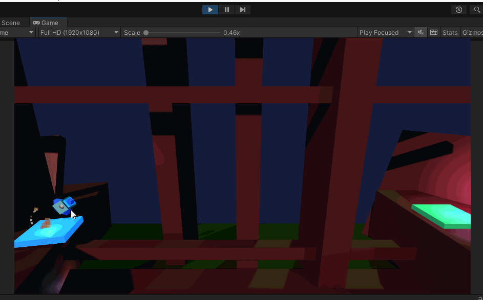

# Booster-Spaceship-game_Unity
Just a game drive a spaceship from launching to landing pad, but it may be a real challenge.

Link play: <a href="https://halac123b.github.io/Booster-Spaceship-game_Unity/">Github page</a>

*You should turn volume smaller
 

Use A, D to rotate ship to left, right.

Press Space to boost ship fly up.

For debug purpose, or to make game easier, I add debug key:  C: toggle collision, L: load next level

 

One more 3D game.

